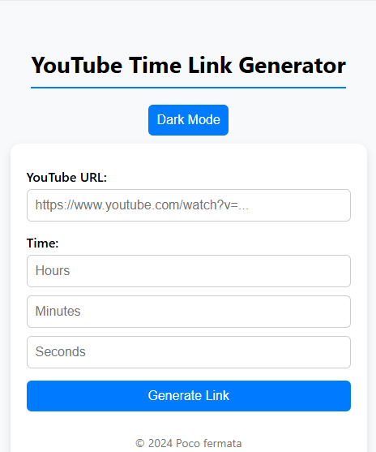
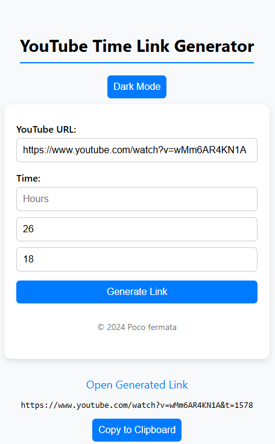
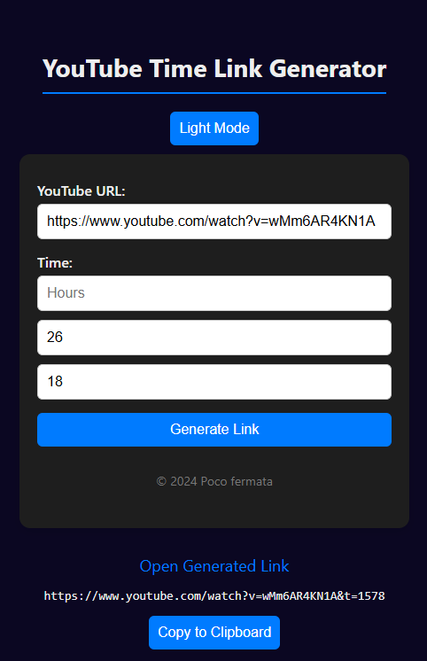

# YouTube Time Link Generator

Creates time-stamped YouTube links.  
Perfect for those moments when you want to jump directly to a longer classical music performance or a special passage you want to hear right here.

## Screenshots

  
  
  

➡️ Try it here: [YouTube Time Link Generator](https://makutosi.github.io/youtube-time-link-generator/) 

## Features

- Specify time (hours, minutes, seconds)
- Generates a YouTube URL with the correct timestamp
- Copy and share the link easily
- Dark Mode toggle
- PWA: installable and works offline

## How to Use

1. Paste a YouTube URL.
2. Enter the time you want to start from.
3. Click "Generate Link" and copy the result.

## License

MIT — © 2024-2025 Poco fermata
